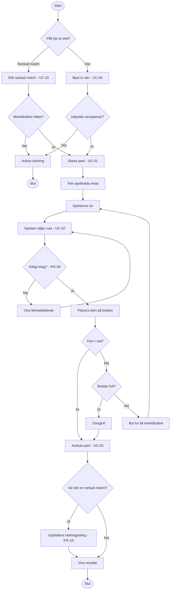

### Detta diagram skapades av Claude för att ge läsare uppfattning om båda funktionella krav gällande verksamhetsregler,
### men även tillhörande icke-funktionella krav. Bland annat följande:

- **UC-01** (Starta spel), **UC-02** (Placera sten), **UC-03** (Avsluta parti), **UC-04** (Bjud in vän), **UC-20** (Rankad match)
- **IFK-05** (systemet validerar dragen) som beslutspunkten "Giltigt drag?"
- **IFK-10** (rankingberäkning) som steget efter en rankad match avgörs
