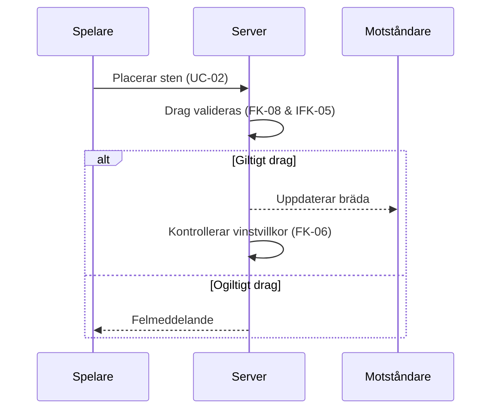
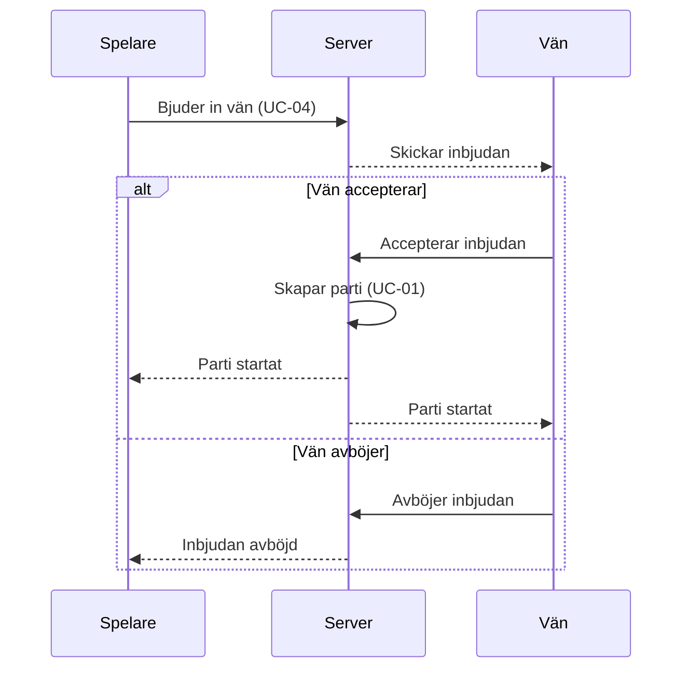

## Sekvensdiagram

#### Sekvensdiagram 1: Placera sten & validera drag
- Berör Funktionella krav: FK-02 (Placera sten), FK-06 (Beräkna vinst), FK-08 (Ogiltiga drag hanteras korrekt)
- Samt Icke-funktionella krav: IFK-05 (drag valideras)

#### Sekvensdiagram 2: Bjud in vän
- Följande diagram visar systemts flöde för en spelare att bjuda in en vän(motståndare).
- Diagram berör UC-01(Starta parti), samt UC-04(Bjud in vän).

