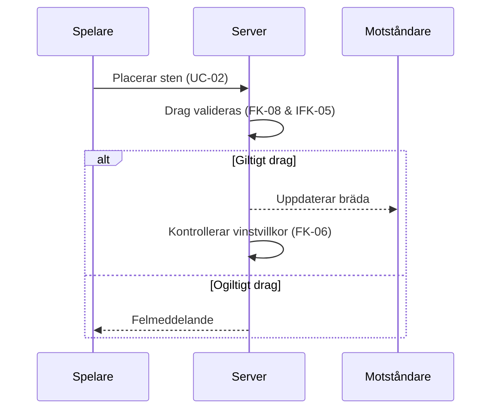

## Sekvensdiagram

#### Sekvensdiagram 1: Placera sten & validera drag
- Berör Funktionella krav: FK-02 (Placera sten), FK-06 (Beräkna vinst), FK-08 (Ogiltiga drag hanteras korrekt)
- Samt Icke-funktionella krav: IFK-05 (drag valideras)

